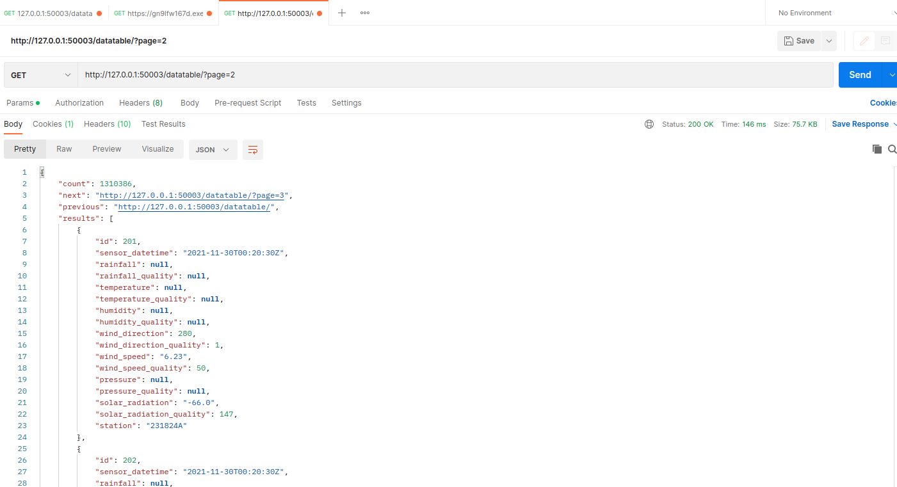
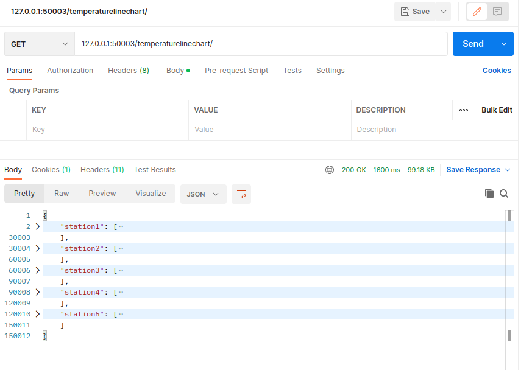
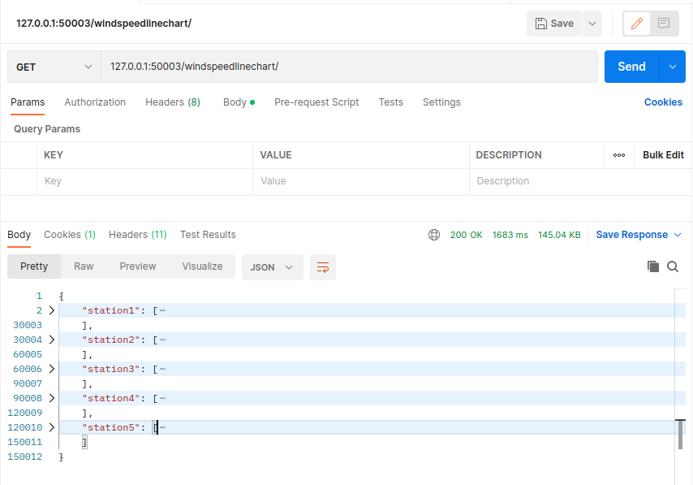
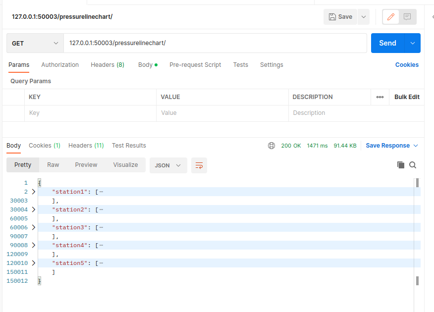
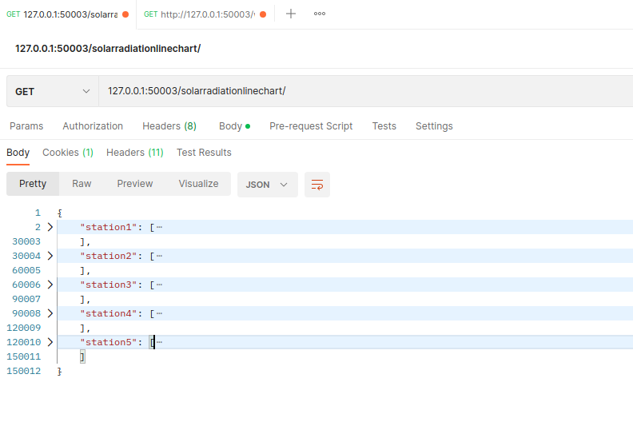
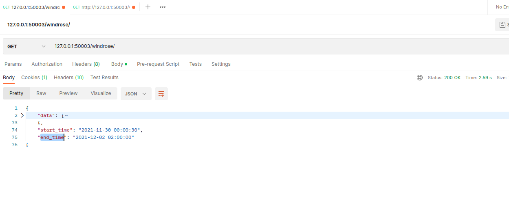
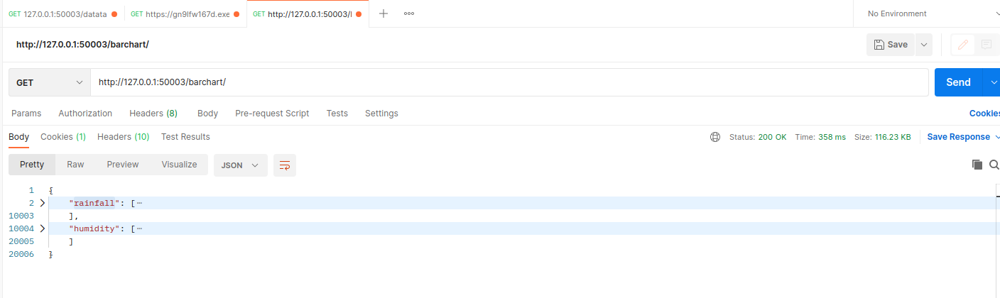
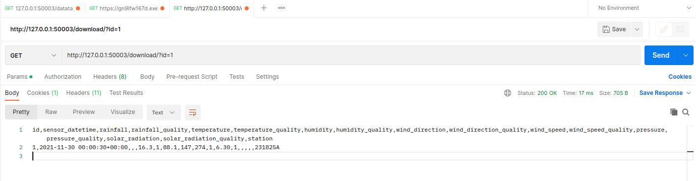

# API Document
## 1. Data Table API
### 1. Interface description
First, all data is returned in the form of pages, each page has 200 pieces of data.
Second, query the data by the id and the station name, and return the query result with paginiation.
### 2. URL
http://127.0.0.1:50003/datatable/?page=1

http://127.0.0.1:50003/datatable/

http://127.0.0.1:50003/datatable/?page=1&id=1

http://127.0.0.1:50003/datatable/?page=1&id=1&station=231825A

### 3. HTTP request type
GET request
### 4. request parameters
There is not any parameter in the request body. However, the query conditions should be in the URL.
### 5. response field

| field    | description    | type   |
|----------|-----|--------|
| count    |  the number of the response data   | int    |
| next     |   the next page URL  | string |
| previous | the previous page URL    | string |
| results  |   the response data from the database  | list   |


### 6. request example



### 7. response example
```commandline
{
    "count": 1,
    "next": null,
    "previous": null,
    "results": [
        {
            "id": 1,
            "sensor_datetime": "2021-11-30T00:00:30Z",
            "rainfall": null,
            "rainfall_quality": null,
            "temperature": "16.3",
            "temperature_quality": 1,
            "humidity": "88.1",
            "humidity_quality": 147,
            "wind_direction": 274,
            "wind_direction_quality": 1,
            "wind_speed": "6.30",
            "wind_speed_quality": 1,
            "pressure": null,
            "pressure_quality": null,
            "solar_radiation": null,
            "solar_radiation_quality": null,
            "station": "231825A"
        }
    ]
}

```


## 2. Temperature Line Chart API
### 1. Interface description
Return all the data required by the previous Temperature line chart.
### 2. URL
http://127.0.0.1:50003/temperaturelinechart/

http://127.0.0.1:50003/temperaturelinechart/?start_time=2021-12-05T00:00&end_time=2021-12-10T00:00
### 3. HTTP request type
GET request
### 4. request parameters
There is not any parameter in the request body. 
However, the query conditions(start_time and end_time) should be in the URL.
### 5. response field

| field    | description          | type |
|----------|----------------------|------|
| station1 | the data of station1 | list |
| station2 | the data of station2 | list |
| station3 | the data of station3 | list |
| station4 | the data of station4 | list |
| station5 | the data of station5 | list |

### 6. request example



### 7. response example
```commandline
{
    "station1": [
        [
            1638230430000.0,
            null,
            "231824A"
        ],
        [
            1638230460000.0,
            null,
            "231824A"
        ],
        [
            1638230490000.0,
            null,
            "231824A"
        ],
        ...
    ],
    "station2": [
        [
            1638230430000.0,
            "16.3",
            "231825A"
        ],
        [
            1638230460000.0,
            "16.4",
            "231825A"
        ],
        [
            1638230490000.0,
            null,
            "231825A"
        ],
        ...
    ],
    "station3": [
        [
            1638230430000.0,
            "16.5",
            "231826A"
        ],
        [
            1638230460000.0,
            "16.5",
            "231826A"
        ],
        [
            1638230490000.0,
            "16.5",
            "231826A"
        ],
        ...
    ],
    "station4": [
        [
            1638230430000.0,
            null,
            "231827A"
        ],
        [
            1638230460000.0,
            null,
            "231827A"
        ],
        [
            1638230490000.0,
            null,
            "231827A"
        ],
        [
            1638230520000.0,
            null,
            "231827A"
        ],
        ...
    ],
    "station5": [
        [
            1638230430000.0,
            null,
            "231828A"
        ],
        [
            1638230460000.0,
            null,
            "231828A"
        ],
        [
            1638230490000.0,
            null,
            "231828A"
        ],
        ...
    ]
}
```

## 3. Wind Speed Line Chart API
### 1. Interface description
Return all the data required by the previous Wind Speed line chart.
### 2. URL
http://127.0.0.1:50003/windspeedlinechart/

http://127.0.0.1:50003/windspeedlinechart/?start_time=2021-12-05T00:00&end_time=2021-12-10T00:00
### 3. HTTP request type
GET request
### 4. request parameters
There is not any parameter in the request body. 
However, the query conditions(start_time and end_time) should be in the URL.
### 5. response field

| field    | description          | type |
|----------|----------------------|------|
| station1 | the data of station1 | list |
| station2 | the data of station2 | list |
| station3 | the data of station3 | list |
| station4 | the data of station4 | list |
| station5 | the data of station5 | list |

### 6. request example



### 7. response example
```commandline
{
    "station1": [
        [
            1638230430000.0,
            "5.67",
            "231824A"
        ],
        [
            1638230460000.0,
            "5.33",
            "231824A"
        ],
        [
            1638230490000.0,
            "5.33",
            "231824A"
        ],
        ...
    ],
    "station2": [
        [
            1638230430000.0,
            "6.30",
            "231825A"
        ],
        [
            1638230460000.0,
            "6.50",
            "231825A"
        ],
        [
            1638230490000.0,
            "6.57",
            "231825A"
        ],
        ...
    ],
    "station3": [
        [
            1638230430000.0,
            "9.70",
            "231826A"
        ],
        [
            1638230460000.0,
            "9.63",
            "231826A"
        ],
        [
            1638230490000.0,
            "9.77",
            "231826A"
        ],
        ...
    ],
    "station4": [
        [
            1638230430000.0,
            "9.10",
            "231827A"
        ],
        [
            1638230460000.0,
            "8.00",
            "231827A"
        ],
        [
            1638230490000.0,
            "8.90",
            "231827A"
        ],
        ...
    ],
    "station5": [
        [
            1638230430000.0,
            "8.20",
            "231828A"
        ],
        [
            1638230460000.0,
            "8.33",
            "231828A"
        ],
        [
            1638230490000.0,
            "8.33",
            "231828A"
        ],
        ...
    ]
}
```


## 4. Pressure Line Chart API
### 1. Interface description
Return all the data required by the previous Pressure line chart.
### 2. URL
http://127.0.0.1:50003/pressurelinechart/

http://127.0.0.1:50003/pressurelinechart/?start_time=2021-12-05T00:00&end_time=2021-12-10T00:00
### 3. HTTP request type
GET request
### 4. request parameters
There is not any parameter in the request body. 
However, the query conditions(start_time and end_time) should be in the URL.
### 5. response field

| field    | description          | type |
|----------|----------------------|------|
| station1 | the data of station1 | list |
| station2 | the data of station2 | list |
| station3 | the data of station3 | list |
| station4 | the data of station4 | list |
| station5 | the data of station5 | list |

### 6. request example



### 7. response example
```commandline
{
    "station1": [
        [
            1638230430000.0,
            null,
            "231824A"
        ],
        [
            1638230460000.0,
            null,
            "231824A"
        ],
        [
            1638230490000.0,
            null,
            "231824A"
        ],
        ...
    ],
    "station2": [
        [
            1638230430000.0,
            null,
            "231825A"
        ],
        [
            1638230460000.0,
            null,
            "231825A"
        ],
        [
            1638230490000.0,
            null,
            "231825A"
        ],
        ...
    ],
    "station3": [
        [
            1638230430000.0,
            null,
            "231826A"
        ],
        [
            1638230460000.0,
            null,
            "231826A"
        ],
        [
            1638230490000.0,
            null,
            "231826A"
        ],
        ...
    ],
    "station4": [
       [
            1638230430000.0,
            null,
            "231827A"
        ],
        [
            1638230460000.0,
            null,
            "231827A"
        ],
        [
            1638230490000.0,
            null,
            "231827A"
        ],
        ...
    ],
    "station5": [
        [
            1638230430000.0,
            null,
            "231828A"
        ],
        [
            1638230460000.0,
            null,
            "231828A"
        ],
        [
            1638230490000.0,
            null,
            "231828A"
        ],
        ...
    ]
}
```

## 5. Solar Radiation Line Chart API
### 1. Interface description
Return all the data required by the previous Solar Radiation line chart.
### 2. URL
http://127.0.0.1:50003/solarradiationlinechart/

http://127.0.0.1:50003/solarradiationlinechart/?start_time=2021-12-05T00:00&end_time=2021-12-10T00:00
### 3. HTTP request type
GET request
### 4. request parameters
There is not any parameter in the request body. 
However, the query conditions(start_time and end_time) should be in the URL.
### 5. response field

| field    | description          | type |
|----------|----------------------|------|
| station1 | the data of station1 | list |
| station2 | the data of station2 | list |
| station3 | the data of station3 | list |
| station4 | the data of station4 | list |
| station5 | the data of station5 | list |

### 6. request example



### 7. response example
```commandline
{
    "station1": [
        [
            1638230430000.0,
            "-65.6",
            "231824A"
        ],
        [
            1638230460000.0,
            "-66.6",
            "231824A"
        ],
        [
            1638230490000.0,
            "-68.7",
            "231824A"
        ],
        ...
    ],
    "station2": [
       [
            1638230430000.0,
            null,
            "231825A"
        ],
        [
            1638230460000.0,
            null,
            "231825A"
        ],
        [
            1638230490000.0,
            null,
            "231825A"
        ],
        ...
    ],
    "station3": [
        [
            1638230430000.0,
            null,
            "231826A"
        ],
        [
            1638230460000.0,
            null,
            "231826A"
        ],
        [
            1638230490000.0,
            null,
            "231826A"
        ],
        ...
    ],
    "station4": [
        [
            1638230430000.0,
            null,
            "231827A"
        ],
        [
            1638230460000.0,
            null,
            "231827A"
        ],
        [
            1638230490000.0,
            null,
            "231827A"
        ],
        ...
    ],
    "station5": [
        [
            1638230430000.0,
            "-61.6",
            "231828A"
        ],
        [
            1638230460000.0,
            "-60.7",
            "231828A"
        ],
        [
            1638230490000.0,
            "-62.1",
            "231828A"
        ],
        ...
    ]
}
```

## 6. Wind Rose Chart API
### 1. Interface description
Return all the data required by the previous Wind Rose chart.
### 2. URL
http://127.0.0.1:50003/windrose/

http://127.0.0.1:50003/windrose/?start_time=2021-12-01T00:00&end_time=2021-12-06T00:00&station=231825A
### 3. HTTP request type
GET request
### 4. request parameters
There is not any parameter in the request body. 
However, the query conditions(start_time, end_time and station) should be in the URL.### 5. response field

| field | description                      | type |
|-------|----------------------------------|------|
| data | the data for the wind rose chart | list |
| start_time | the start time of the data       | list |
| end_time | the end time of the data         | list |

### 6. request example



### 7. response example
```commandline
{
    "data": {
        "0": [
            0.02,
            0.02,
            0.01,
            0.01,
            0.0,
            0.03,
            0.02,
            0.03
        ],
        "1": [
            0.44,
            0.35,
            0.1,
            0.05,
            0.05,
            0.18,
            0.13,
            0.23
        ],
        "2": [
            2.75,
            1.29,
            0.32,
            0.27,
            0.38,
            0.44,
            0.6,
            2.11
        ],
        "3": [
            5.06,
            2.07,
            0.52,
            0.91,
            1.3,
            1.09,
            0.75,
            3.22
        ],
        "4": [
            2.51,
            3.35,
            1.78,
            1.31,
            1.32,
            1.6,
            1.1,
            1.93
        ],
        "5": [
            1.04,
            4.12,
            4.43,
            1.36,
            1.32,
            1.01,
            0.88,
            0.86
        ],
        "6": [
            6.78,
            6.34,
            18.44,
            4.04,
            1.52,
            0.7,
            1.34,
            3.75
        ]
    },
    "start_time": "2021-11-30 00:00:30",
    "end_time": "2021-12-02 02:00:00"
}
```


## 3. Bar Char API
### 1. Interface description
Return all the data required by the previous bar chart.
### 2. URL
http://127.0.0.1:50003/barchart/
### 3. HTTP request type
GET request
### 4. request parameters
There is not any parameter in the request body.
### 5. response field

| field    | description                  | type |
|-----|------------------------------|------|
| rainfail   | the rainfail of all the data | list |
| humidity   | the humidity of all the data | list |
	
### 6. request example



### 7. response example
```commandline
{
  "rainfall":[ 
    null,
    null,
    null,
    null,
    null,
    null,
  ],
  "humidity": [
    "88.1",
    "86.3",
    null,
    null,
    "88.5",
    "88.5",
  ],
}
```

## 4. Download API
### 1. Interface description
Download the data as a CSV file. It supports the downlaod of all data, 
as well as the data queried by condition. The query conditions should be included in the url. 
### 2. URL
Download all:  

http://127.0.0.1:50003/download/ 

Download the data with query condition id:  

http://127.0.0.1:50003/datatable/?id=1 

Download the data with query condition station:  

http://127.0.0.1:50003/datatable/?station=231825A 

### 3. HTTP request type
GET request
### 4. request parameters
There is not any parameter in the request body. However, the query conditions should be in the URL, 
like the latter two urls in the URL part. 
### 5. response field
The response is a data stream as a HTTP response, and the content type is "text/csv" .
### 6. request example

### 7. response example
id,sensor_datetime,rainfall,rainfall_quality,temperature,temperature_quality,humidity,humidity_quality,wind_direction,wind_direction_quality,wind_speed,wind_speed_quality,pressure,pressure_quality,solar_radiation,solar_radiation_quality,station

1,2021-11-30 00:00:30+00:00,,,16.3,1,88.1,147,274,1,6.30,1,,,,,231825A


