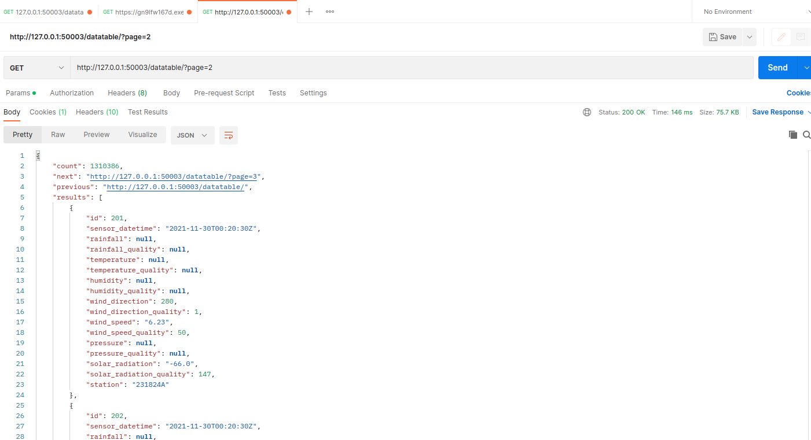
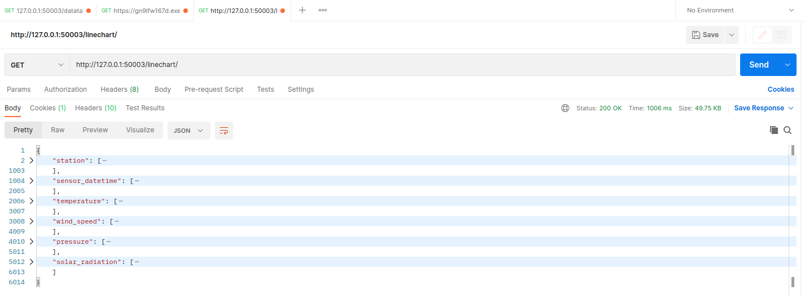
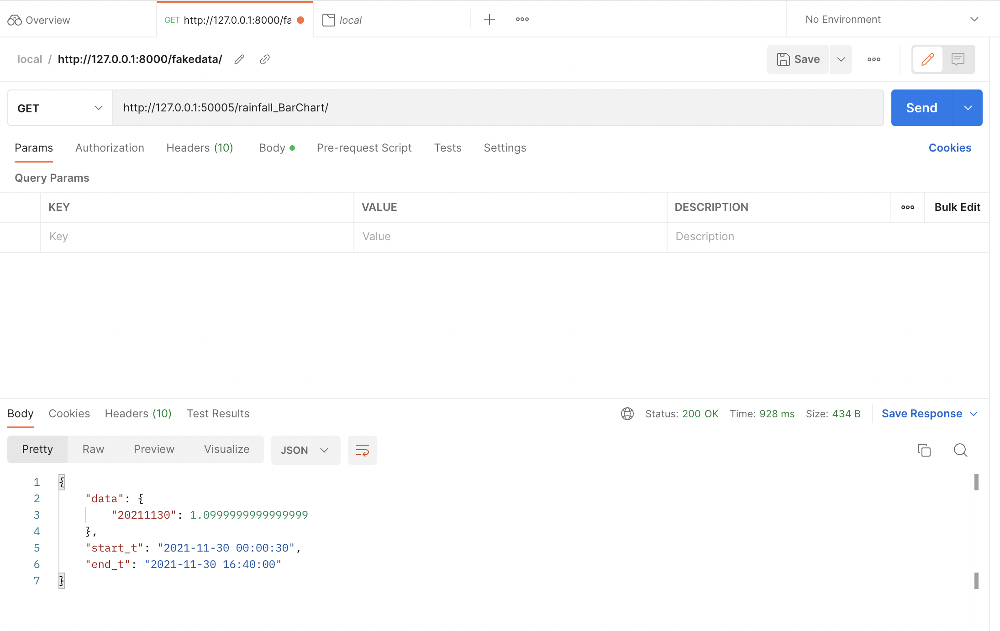
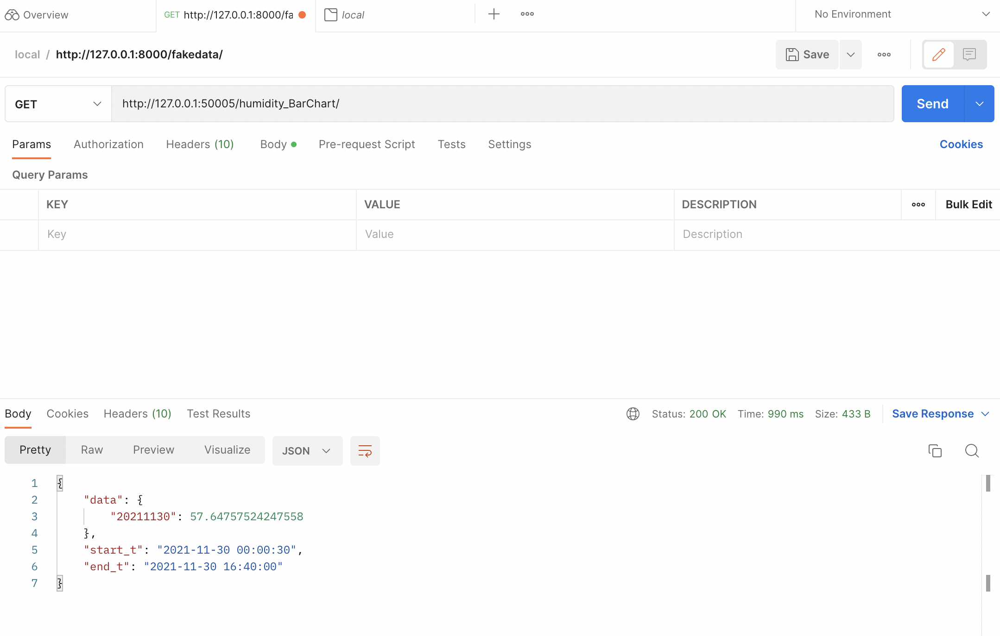
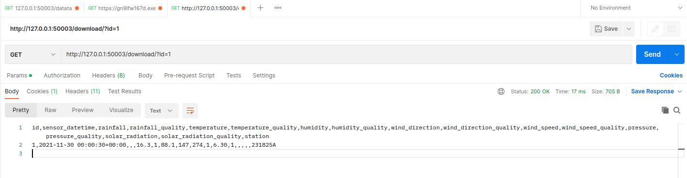

# API Document

## 1. Data Table API(Changhao Liu 22924454)

### 1. Interface description

First, all data is returned in the form of pages, each page has 200 pieces of data.
Second, query the data by the id and the station name, and return the query result with paginiation.

### 2. URL

http://127.0.0.1:50003/datatable/?page=1

http://127.0.0.1:50003/datatable/

http://127.0.0.1:50003/datatable/?page=1&id=1

http://127.0.0.1:50003/datatable/?page=1&id=1&station=231825A

### 3. HTTP request type

GET request

### 4. request parameters

There is not any parameter in the request body. However, the query conditions should be in the URL.

### 5. response field

| field    | description    | type   |
|----------|-----|--------|
| count    |  the number of the response data   | int    |
| next     |   the next page URL  | string |
| previous | the previous page URL    | string |
| results  |   the response data from the database  | list   |

### 6. request example



### 7. response example

```commandline
{
    "count": 1,
    "next": null,
    "previous": null,
    "results": [
        {
            "id": 1,
            "sensor_datetime": "2021-11-30T00:00:30Z",
            "rainfall": null,
            "rainfall_quality": null,
            "temperature": "16.3",
            "temperature_quality": 1,
            "humidity": "88.1",
            "humidity_quality": 147,
            "wind_direction": 274,
            "wind_direction_quality": 1,
            "wind_speed": "6.30",
            "wind_speed_quality": 1,
            "pressure": null,
            "pressure_quality": null,
            "solar_radiation": null,
            "solar_radiation_quality": null,
            "station": "231825A"
        }
    ]
}

```

## 2. Line Chart API(Changhao Liu 22924454)

### 1. Interface description

Return all the data required by the previous line chart.

### 2. URL

http://127.0.0.1:50003/linechart/

### 3. HTTP request type

GET request

### 4. request parameters

There is not any parameter in the request body.

### 5. response field

| field           | description | type |
|-----------------|-------------|------|
| station         | the station of all the data            | list |
| sensor_datetime | the sensor datetime of all the data            | list |
| temperature                | the temperature of all the data            | list |
| wind_speed                |  the wind speed of all the data           | list |
| pressure                |  pressure of all the data           | list |
| solar_radiation                |  he solar radiation of all the data           | list |

### 6. request example



### 7. response example

```commandline
{
  "station":[ 
    "231824A",
    "231828A",
    "231826A",
    "231827A",
    "231825A",
    "231827A",
  ],
  "sensor_datetime": [
    1638230430000.0,
    1638230430000.0,
    1638230430000.0,
    1638230430000.0,
    1638230430000.0,
    1638230460000.0,
  ],
  "temperature": [
    null,
    null,
    "16.5",
    null,
    "16.3",
    null,
  ],
  "wind_speed":[
    "5.67",
    "8.20",
    "9.70",
    "9.10",
    "6.30",
    "8.00",
  ],
  "pressure":[
    null,
    null,
    null,
    null,
    null,
    null,
  ],
  "solar_radiation":[
    "-65.6",
    "-61.6",
    null,
    null,
    null,
    null,
  ],
}
```

## 3.Rainfall Bar Char API(Charlie Hu 23217014)

### 1. Interface description

Return all the data required by the rainfall bar chart.

### 2. URL

http://127.0.0.1:50003/rainfall_BarChart/

### 3. HTTP request type

GET request

### 4. request parameters

There is not any parameter in the request body.

### 5. response field

| field   | description                                 | type |
|---------|---------------------------------------------|------|
| data    | key is time, value is the sum of rainfall   | dic  |
| start_t | start time                                  | str  |
| end_t   | end time                                    | str  |

### 6. request example



### 7. response example

```commandline
{
    "data": {
        "20211130": 1.0999999999999999
    },
    "start_t": "2021-11-30 00:00:30",
    "end_t": "2021-11-30 16:40:00"
}
```

## 4.Humidity Bar Char API(Charlie Hu 23217014)

### 1. Interface description

Return all the data required by the humidity bar chart.

### 2. URL

http://127.0.0.1:50005/humidity_BarChart/

### 3. HTTP request type

GET request

### 4. request parameters

There is not any parameter in the request body.

### 5. response field

| field   | description                               | type |
|---------|-------------------------------------------|------|
| data    | key is time, value is the sum of rainfall | dict |
| start_t | start time                                | str  |
| end_t   | end time                                  | str  |

### 6. request example



### 7. response example

```commandline
{
    "data": {
        "20211130": 57.64757524247558
    },
    "start_t": "2021-11-30 00:00:30",
    "end_t": "2021-11-30 16:40:00"
}
```

## 5. Download API(Yinuo Zhao 23112901)

### 1. Interface description

Download the data as a CSV file. It supports the downlaod of all data,
as well as the data queried by condition. The query conditions should be included in the url.

### 2. URL

Download all:

http://127.0.0.1:50003/download/

Download the data with query condition id:

http://127.0.0.1:50003/datatable/?id=1

Download the data with query condition station:

http://127.0.0.1:50003/datatable/?station=231825A

### 3. HTTP request type

GET request

### 4. request parameters

There is not any parameter in the request body. However, the query conditions should be in the URL,
like the latter two urls in the URL part.

### 5. response field

The response is a data stream as a HTTP response, and the content type is "text/csv" .

### 6. request example



### 7. response example

id,sensor_datetime,rainfall,rainfall_quality,temperature,temperature_quality,humidity,humidity_quality,wind_direction,wind_direction_quality,wind_speed,wind_speed_quality,pressure,pressure_quality,solar_radiation,solar_radiation_quality,station

1,2021-11-30 00:00:30+00:00,,,16.3,1,88.1,147,274,1,6.30,1,,,,,231825A


