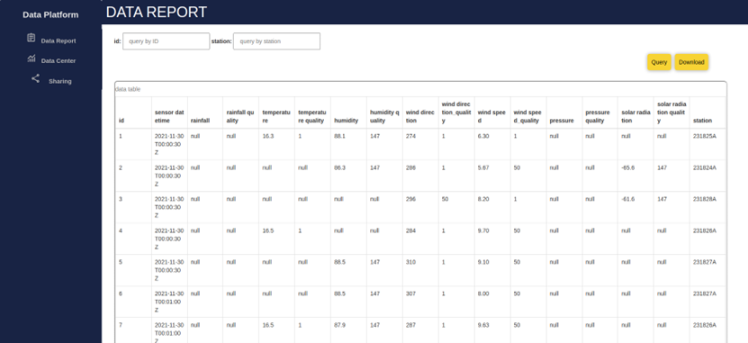
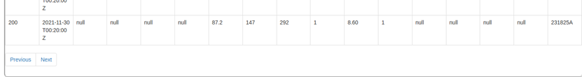
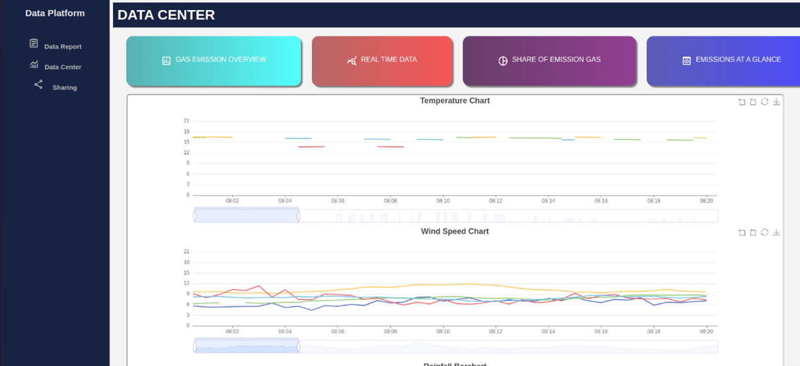

# User Manual 

## Data Display page: 

On the left of this page is a navigation bar, user can jump to the data display page and the visualization page. 

At the top of the data display page, users can input query conditions to search for the data that they want. 

After inputting the data, users can click the query button to see the query result. 

In the central part of the page, there is a table to display all the data or the query result.  

In the upper right corner of the data table, there is a download button. Users can click this download button to download all the data or the query result data as a CSV file. 

 

page two

We have a pagination function in our system. At the end of the data table, the user can click the “Previous” button or the “Next” button to the previous page or next page. There are up to 200 rows of data on one page. 

 
## Data Visualization page: 

On the data visualization page, there are some titles at the top of this page. Behind the titles, there are several statistical charts of the data. Users can click the download buttons on every chart to download the chart from our system. 