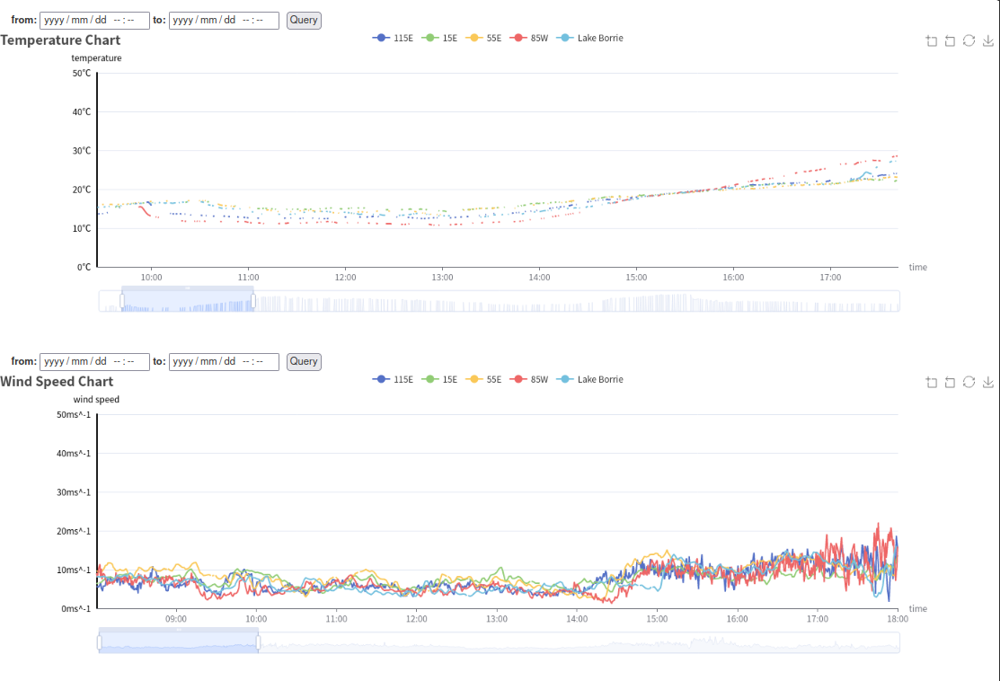

# User Manual 

## Data Display page: 

By clicking the blue navigation bar on the left side of the page, the user can jump to either the "data display" or "visualization page" pages.

At the top of the data display page, users can input related information into the search bars to search for the data they want, 
and user also can query the data by the time range. 
The user can see the search result by clicking the "query" button, 
and the result will be shown as a table and displayed at the centre of the page. 

In the upper right corner of the data table, there is a "download" button. 
Users can click this button to download all the data or the query result data as a CSV file.

 

page two:

As above, we have a pagination function in our system. 
There are up to 200 rows of data on one page. At the end of the data table, 
the user can click the “Previous” to return to the last page or the “Next” button to go to the next page. 
 
## Data Visualization page: 

There are four navigation bars on the top of the data visualisation page. 
By clicking each navigation bar, the user can see the corresponding charts of the statistical data below those bars.

In the top of the visualisation page, 
there are seven title of all the charts that can be clicked to jump to the corresponding chart directly.

For the line charts, user can input the time range in the top of the line charts, 
and click the query button to view the chart in a specific period.
The timeline below the image allows users to adjust the time granularity.
Moreover, user can click the legend to select which station should be display in the line chart.
Finally, user can click the download button in the upper right corner of the line chart to download the chart screen shot.

For the bar charts, user can input the time range in the top of the bar charts, 
and click the query button to view the chart in a specific period.
For the rainfall chart, each bar is the sum of rainfall in a day.
For the humidity chart, each bar is the average of humidity in a day.
The user also can select the station that should be displayed in the bar chart. The 231824A station is the default station.
Finally, user can click the download button in the upper right corner of the line chart to download the chart screen shoot.

For the wind rose charts, user can input the time range in the top of the wind rose charts, 
and click the query button to view the chart in a specific period.
The user also can select the station that should be displayed in the wind rose chart. The 231824A station is the default station.
In the wind rose chart, there are 8 sector regions for different 8 directions. 
The size of the sector represents the proportion of the wind in this direction in all directions.
In every single sector, the different sector with different color represents different speed wind.
In each sector area, the size of different color areas represents the proportion of wind with different speeds in all winds in this direction.
Moreover, user can click the legend to select what speed of wind should be display in the line chart.
Finally, user can click the download button in the upper right corner of the line chart to download the chart screen shoot.

